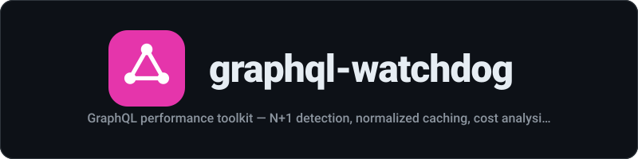

<div align="center">
  
</div>

<p align="center"><strong>GraphQL performance toolkit — N+1 detection, normalized caching, cost analysis, and CI regression testing</strong></p>

<p align="center">
  <a href="LICENSE"></a>
  <a href="https://www.npmjs.com/package/graphql-watchdog"></a>
  
</p>

---
GraphQL performance toolkit -- N+1 detection, normalized caching, cost analysis, and CI regression testing.

## Features

- **N+1 Query Detection** -- Automatically detects N+1 patterns in resolver execution and suggests DataLoader fixes
- **Query Cost Analysis** -- AST-based cost calculation with configurable field costs, list multipliers, and hard limits
- **Query Optimization Suggestions** -- Analyzes queries and suggests pagination, fragments, DataLoader usage, and more
- **Dynamic Cost Tracking** -- Automatically derives cost weights from actual resolver performance data
- **Normalized Response Cache** -- Entity-level caching with LRU eviction, TTL expiration, and type/entity-based invalidation
- **Pluggable Cache Backends** -- In-memory, Redis, and Cloudflare KV backends via the CacheBackend interface
- **Performance Dashboard** -- Self-contained HTML dashboard with score gauges, charts, and trend tracking
- **Server Plugins** -- Drop-in plugins for GraphQL Yoga and Apollo Server
- **CLI Tooling** -- Static analysis and benchmarking commands for CI/CD pipelines
- **CI Regression Testing** -- Benchmark operations against endpoints with p50/p95/p99 tracking and regression detection

## Quick Start

```bash
npm install graphql-watchdog graphql
```

### With GraphQL Yoga

```typescript
import { createYoga, createSchema } from 'graphql-yoga';
import { useWatchdog } from 'graphql-watchdog';

const yoga = createYoga({
  schema: createSchema({ /* your schema */ }),
  plugins: [
    useWatchdog({
      enableDetector: true,
      enableCost: true,
      cost: {
        maxCost: 1000,
        defaultListMultiplier: 10,
      },
      enableCache: true,
      cache: {
        maxSize: 500,
        ttl: 60000,
      },
    }),
  ],
});
```

### With Apollo Server

```typescript
import { ApolloServer } from '@apollo/server';
import { watchdogApolloPlugin } from 'graphql-watchdog';

const server = new ApolloServer({
  typeDefs,
  resolvers,
  plugins: [
    watchdogApolloPlugin({
      enableDetector: true,
      onDetection: (detections) => {
        detections.forEach((d) => {
          console.warn(`N+1 detected: ${d.field} (${d.callCount} calls)`);
        });
      },
    }),
  ],
});
```

## Requirements

- Node.js >= 18.0.0
- `graphql` >= 16.0.0 (peer dependency)
- `graphql-yoga` >= 5.0.0 (optional, for Yoga plugin)
- `@apollo/server` >= 4.0.0 (optional, for Apollo plugin)
- `ioredis` >= 5.0.0 (optional, for Redis cache backend)
- TypeScript >= 5.0 (optional, for type definitions)

Fully written in TypeScript with complete type exports for all public APIs.

## Usage

### N+1 Detection

The detector instruments resolver functions to track execution patterns and identify N+1 queries:

```typescript
import { ResolverInstrumenter, analyzeForN1 } from 'graphql-watchdog';

const instrumenter = new ResolverInstrumenter();
const instrumented = instrumenter.instrumentResolvers(resolvers);

// ... execute GraphQL operations using instrumented resolvers ...

const detections = analyzeForN1(instrumenter.getCalls());
// [{ field: 'Post.author', callCount: 10, severity: 'critical', suggestion: '...' }]
```

### Cost Analysis

Analyze query cost statically from the AST:

```typescript
import { analyzeCost, costLimitRule } from 'graphql-watchdog';
import { parse, validate } from 'graphql';

const query = parse(`
  query {
    posts(first: 20) {
      title
      author { name }
      comments(first: 10) { text }
    }
  }
`);

const breakdown = analyzeCost(query, schema, {
  maxCost: 500,
  defaultListMultiplier: 10,
  costMap: {
    'Query.posts': 2,
    'Post.comments': 5,
  },
});

console.log(breakdown.totalCost);  // calculated cost
console.log(breakdown.exceeds);     // true if over maxCost

// Or use as a validation rule
const errors = validate(schema, query, [costLimitRule(schema, { maxCost: 500 })]);
```

### Query Optimization Suggestions

Analyze queries and get actionable optimization suggestions:

```typescript
import { analyzeCost, suggestOptimizations } from 'graphql-watchdog';
import { parse } from 'graphql';

const query = parse(`
  query {
    allUsers {
      name
      posts {
        title
        author { name }
        comments {
          text
          author { name }
        }
      }
    }
  }
`);

const breakdown = analyzeCost(query, schema);
const suggestions = suggestOptimizations(breakdown, query, schema);

for (const suggestion of suggestions) {
  console.log(`[${suggestion.severity}] ${suggestion.type}: ${suggestion.message}`);
  console.log(`  Estimated saving: ${suggestion.estimatedSaving}`);
}
```

Suggestion types:
- **pagination** -- Unbounded list fields missing `first`/`limit` arguments
- **field-pruning** -- Deeply nested fields contributing disproportionate cost
- **depth-reduction** -- Queries exceeding 5 levels of nesting
- **fragment** -- Repeated selection sets that could use fragments
- **dataloader** -- Object fields under list parents likely causing N+1 queries

### Dynamic Cost Tracking

Derive cost weights automatically from actual resolver performance:

```typescript
import { DynamicCostTracker, ResolverInstrumenter, analyzeCost } from 'graphql-watchdog';

// Create tracker and wire it to the instrumenter
const tracker = new DynamicCostTracker();
const instrumenter = new ResolverInstrumenter({ costTracker: tracker });
const instrumented = instrumenter.instrumentResolvers(resolvers);

// ... execute queries -- timing data is recorded automatically ...

// Generate cost config from observed performance
const costConfig = tracker.toCostConfig({
  baselineDuration: 10, // 10ms = cost 1
});

// Use dynamic costs for analysis
const breakdown = analyzeCost(query, schema, costConfig);

// Export timing data for persistence
const timingData = tracker.export();
saveToFile(timingData);

// Import on restart
const saved = loadFromFile();
tracker.import(saved);

// Get stats
const stats = tracker.getStats();
console.log(`Tracking ${stats.trackedFields} fields, ${stats.totalCalls} total calls`);
console.log('Slowest fields:', stats.slowestFields);
```

### Response Cache

Normalized caching with automatic invalidation:

```typescript
import { ResponseCache, normalizeResponse, getMutationTypes } from 'graphql-watchdog';

const cache = new ResponseCache({
  maxSize: 1000,
  ttl: 60000, // 1 minute
});

// Cache a response
const { entities, cacheKey } = normalizeResponse(data, 'GetPosts', variables);
cache.set(cacheKey, data, entities);

// Retrieve from cache
const cached = cache.get(cacheKey);

// Invalidate after mutations
const affectedTypes = getMutationTypes(mutationDocument, schema);
affectedTypes.forEach((type) => cache.invalidateByType(type));

// Check stats
const stats = cache.getStats();
// { hits: 50, misses: 10, hitRate: 0.833, entries: 25 }
```

### Cache Backends

The cache supports pluggable backends via the `CacheBackend` interface. The default is in-memory, but you can use Redis or Cloudflare KV.

#### Redis Backend

```bash
npm install ioredis  # optional peer dependency
```

```typescript
import { ResponseCache, RedisCacheBackend } from 'graphql-watchdog';

const redisBackend = new RedisCacheBackend({
  url: 'redis://localhost:6379',
  keyPrefix: 'gql-watchdog:',
});

await redisBackend.connect();

const cache = new ResponseCache({
  maxSize: 10000,
  ttl: 300000,
  backend: redisBackend,
});

// Use cache as normal -- data persists in Redis
cache.set(cacheKey, data, entities);

// For backend-backed caches, use getAsync:
const cached = await cache.getAsync(cacheKey);

// Disconnect when done
await redisBackend.disconnect();
```

#### Cloudflare KV Backend

No additional dependencies -- uses the Workers KV API available at runtime:

```typescript
import { ResponseCache, CloudflareKVBackend } from 'graphql-watchdog';

// In a Cloudflare Worker:
export default {
  async fetch(request, env) {
    const kvBackend = new CloudflareKVBackend({
      namespace: env.GQL_CACHE, // KV namespace binding
      keyPrefix: 'cache:',
    });

    const cache = new ResponseCache({
      ttl: 300000,
      backend: kvBackend,
    });

    // Use normally
  },
};
```

#### Custom Backend

Implement the `CacheBackend` interface to create your own:

```typescript
import type { CacheBackend } from 'graphql-watchdog';

class MyCustomBackend implements CacheBackend {
  async get(key: string): Promise<string | null> { /* ... */ }
  async set(key: string, value: string, ttlMs?: number): Promise<void> { /* ... */ }
  async del(key: string): Promise<void> { /* ... */ }
  async keys(pattern: string): Promise<string[]> { /* ... */ }
  async delMany(keys: string[]): Promise<number> { /* ... */ }
  async clear(): Promise<void> { /* ... */ }
}
```

### Performance Dashboard

Generate a self-contained HTML performance dashboard:

```typescript
import { generateReport, generateDashboard } from 'graphql-watchdog';

// Via generateReport
const html = generateReport(performanceReport, 'dashboard');

// Or directly
const html = generateDashboard(performanceReport);

// Write to file
import { writeFileSync } from 'fs';
writeFileSync('dashboard.html', html);
```

The dashboard includes:
- **Performance score** (0-100) based on N+1 count, cost, and cache hit rate
- **N+1 hotspots table** with field, call count, severity, and DataLoader suggestions
- **Cost breakdown chart** (inline SVG bar chart)
- **Cache stats gauge** with hit rate, entries, and miss count
- **Operations table** sorted by duration
- **localStorage integration** for tracking trends across runs
- Dark theme, fully self-contained (no external dependencies)

### Reporting

Generate performance reports in terminal, JSON, or dashboard format:

```typescript
import { generateReport } from 'graphql-watchdog';

const report = generateReport(performanceReport, 'terminal');   // colored terminal output
const json = generateReport(performanceReport, 'json');          // machine-readable JSON
const html = generateReport(performanceReport, 'dashboard');     // self-contained HTML dashboard
```

## CLI

### Analyze

Run static cost analysis on GraphQL operations:

```bash
graphql-watchdog analyze --schema schema.graphql --operations "queries/**/*.graphql" --max-cost 500
```

Options:
- `--schema <path>` -- Path to GraphQL schema SDL file (required)
- `--operations <glob>` -- Glob pattern for .graphql operation files (required)
- `--max-cost <number>` -- Maximum allowed query cost
- `--default-list-multiplier <number>` -- Default multiplier for list fields
- `--format <terminal|json>` -- Output format (default: terminal)

### Benchmark

Benchmark GraphQL operations with regression detection:

```bash
# Run benchmarks
graphql-watchdog benchmark \
  --endpoint http://localhost:4000/graphql \
  --operations "queries/**/*.graphql" \
  --iterations 50 \
  --output baseline.json

# Compare against baseline (exits 1 on regression)
graphql-watchdog benchmark \
  --endpoint http://localhost:4000/graphql \
  --operations "queries/**/*.graphql" \
  --baseline baseline.json \
  --threshold 20
```

Options:
- `--endpoint <url>` -- GraphQL endpoint URL (required)
- `--operations <glob>` -- Glob pattern for .graphql files (required)
- `--baseline <file>` -- Baseline JSON for regression comparison
- `--iterations <n>` -- Iterations per operation (default: 10)
- `--output <file>` -- Save results to JSON file
- `--threshold <percent>` -- Regression threshold % (default: 20)

## Comparison with Alternatives

graphql-watchdog combines several capabilities that would otherwise require multiple packages:

| Feature | graphql-watchdog | graphql-query-complexity | graphql-depth-limit | apollo-server-plugin-response-cache |
|---------|-----------------|------------------------|--------------------|-------------------------------------|
| Cost analysis | Yes | Yes | No | No |
| N+1 detection | Yes | No | No | No |
| Normalized response cache | Yes | No | No | Yes |
| Dynamic cost tracking | Yes | No | No | No |
| Optimization suggestions | Yes | No | No | No |
| Pluggable cache backends (Redis, CF KV) | Yes | No | No | No |
| CI benchmark regression testing | Yes | No | No | No |
| Performance dashboard | Yes | No | No | No |
| Yoga + Apollo plugins | Yes | Partial | Partial | Apollo only |

Choose graphql-watchdog if you want a unified performance toolkit. Choose individual packages if you only need one specific capability.

## Configuration Reference

### WatchdogConfig

| Option | Type | Default | Description |
|--------|------|---------|-------------|
| `enableDetector` | `boolean` | `true` | Enable N+1 detection |
| `enableCost` | `boolean` | `true` | Enable cost analysis |
| `enableCache` | `boolean` | `false` | Enable response caching |
| `cost` | `CostConfig` | `{}` | Cost analysis configuration |
| `cache` | `CacheConfig` | `{}` | Cache configuration |
| `dynamicCost` | `boolean` | `false` | Enable dynamic cost tracking |
| `dynamicCostBaseline` | `number` | `10` | Milliseconds per cost unit for dynamic tracking |

### CostConfig

| Option | Type | Default | Description |
|--------|------|---------|-------------|
| `defaultFieldCost` | `number` | `1` | Default cost per field |
| `defaultListMultiplier` | `number` | `10` | Default multiplier for list fields |
| `costMap` | `Record<string, number>` | `{}` | Custom costs by `TypeName.fieldName` |
| `maxCost` | `number` | `Infinity` | Maximum allowed query cost |

### CacheConfig

| Option | Type | Default | Description |
|--------|------|---------|-------------|
| `maxSize` | `number` | `1000` | Maximum cache entries |
| `ttl` | `number` | `60000` | Time-to-live in milliseconds |
| `invalidateOnMutation` | `boolean` | `true` | Auto-invalidate on mutations |
| `backend` | `CacheBackend` | `undefined` | External cache backend (Redis, Cloudflare KV, custom) |

## API Reference

### Detection

- `ResolverInstrumenter` -- Wraps resolvers to track execution
  - `constructor(options?)` -- Optional `{ costTracker: DynamicCostTracker }` for automatic timing
  - `.instrumentResolvers(resolvers)` -- Returns instrumented resolver map
  - `.getCalls()` -- Returns recorded resolver calls
  - `.reset()` -- Clears recorded calls
- `analyzeForN1(calls, threshold?)` -- Analyzes calls for N+1 patterns

### Cost

- `analyzeCost(document, schema, config?, variables?)` -- Returns cost breakdown
- `costLimitRule(schema, config)` -- GraphQL validation rule for cost limits
- `suggestOptimizations(breakdown, document, schema, config?)` -- Returns optimization suggestions
- `DynamicCostTracker` -- Tracks resolver performance and generates cost configs
  - `.recordTiming(typeName, fieldName, durationMs)` -- Record a resolver timing
  - `.toCostConfig(options?)` -- Generate CostConfig from observed data
  - `.export()` -- Export timing data for persistence
  - `.import(data)` -- Import previously saved timing data
  - `.getStats()` -- Get summary statistics

### Cache

- `ResponseCache` -- LRU cache with TTL and entity normalization
  - `.set(key, data, entities)` -- Store response
  - `.get(key)` -- Retrieve response (null if expired/missing)
  - `.getAsync(key)` -- Async retrieve (required for backend-backed caches)
  - `.invalidateByType(typename)` -- Invalidate by type name
  - `.invalidateByEntity(typename, id)` -- Invalidate by specific entity
  - `.getStats()` -- Get hit/miss statistics
  - `.clear()` -- Clear all entries
- `normalizeResponse(data, operationName, variables?)` -- Normalize response data
- `getMutationTypes(document, schema)` -- Extract mutation return types

### Cache Backends

- `CacheBackend` -- Interface for pluggable cache storage
- `MemoryCacheBackend` -- In-memory implementation with TTL support
- `RedisCacheBackend` -- Redis backend (requires `ioredis` peer dependency)
  - `.connect()` / `.disconnect()` -- Manage connection lifecycle
- `CloudflareKVBackend` -- Cloudflare Workers KV backend (no deps needed)

### Plugins

- `useWatchdog(config?)` -- GraphQL Yoga plugin
- `watchdogApolloPlugin(config?)` -- Apollo Server plugin

### Reporting

- `generateReport(report, format?)` -- Generate formatted report (`'terminal'`, `'json'`, or `'dashboard'`)
- `generateDashboard(report)` -- Generate self-contained HTML dashboard
- `calculatePerformanceScore(report)` -- Calculate 0-100 performance score

## Contributing

1. Fork the repository
2. Create your feature branch (`git checkout -b feature/my-feature`)
3. Run tests (`npm test`)
4. Commit your changes (`git commit -am 'Add my feature'`)
5. Push to the branch (`git push origin feature/my-feature`)
6. Open a Pull Request

## License

MIT
